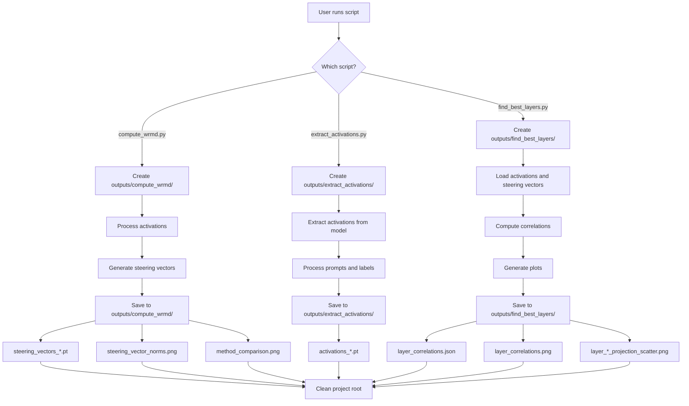

# Workflow Diagram with New Folder Structure

## Script Workflow with Output Organization



## Data Flow Between Scripts

```mermaid
graph LR
    subgraph extract_activations
        A1[extract_activations.py] --> A2[outputs/extract_activations/activations_*.pt]
    end
    
    subgraph compute_wrmd
        B1[compute_wrmd.py] --> B2[outputs/compute_wrmd/steering_vectors_*.pt]
    end
    
    subgraph find_best_layers
        C1[find_best_layers.py] --> C2[outputs/find_best_layers/analysis_results]
    end
    
    A2 --> B1
    A2 --> C1
    B2 --> C1
    
    style A1 fill:#e1f5fe
    style B1 fill:#e8f5e9
    style C1 fill:#fff3e0
    style A2 fill:#e1f5fe
    style B2 fill:#e8f5e9
    style C2 fill:#fff3e0